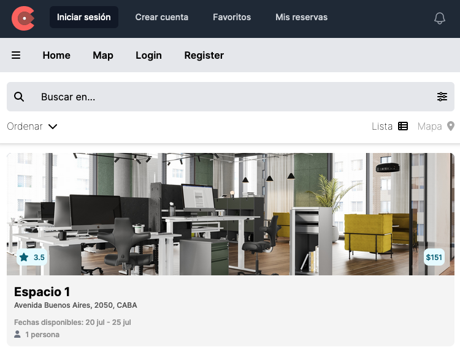

# s9-04-t-java-angular

## Aplicación de Co-Working

Nuestra aplicación está pensada para conectar a los usuarios que ofrecen sus espacios físicos en nuestra plataforma, con los usuarios que buscan espacios de trabajo colaborativo con los servicios más requeridos por el perfil de nómada digital.

---

## 🔗 [Deploy Frontend](https://s9-04-t-java-angular.web.app "Deploy Frontend")

## 🔗 [Figma UXUI](https://www.figma.com/file/FSoehluxDIyhCeOCUYGLay/WOCO---NoCountry?type=design&node-id=0-1&mode=design&t=Xczgw6lLBz3uZloG-0 "Figma UXUI")

---

## 🛠 Teck Stack
---
### **Frontend:** 
#### Angular, CDK, Javascript, HTML, CSS, Tailwind, FontAwesome, Leaflet, Firebase
### **Developers:**
* Elcira Ibarra | [Linkedin](https://www.linkedin.com/in/elcicode/ "Linkedin") | [Github](https://github.com/elcicode "Github")
* Federico Burgos | [Linkedin](https://www.linkedin.com/in/federicoburgos "Linkedin") | [Github](https://github.com/fedev95 "Github")
* Daniel Miño | [Linkedin](https://www.linkedin.com/in/daniel-mi%C3%B1o-b89b76200 "Linkedin") | [Github](https://github.com/DanielMino19 "Github")
* Pedro Saavedra | Lindedin | Github
* Leonel Perez | [Linkedin](https://www.linkedin.com/in/leonelpb/  "Linkedin") | [Github](https://github.com/leonelpb "Github")
---
### **Backend:**
#### Java, Spring Boot, JWT, Railway
### **Developers:** 
* Braian Apellido | [Linkedin](https://www.linkedin.com/in/braian-marquez-8741071b2 "Linkedin") | [Github](https://github.com/Braian-Marquez "Github")
* Armando Apellido | Linkedin | Github
* Erik Jose | [Linkedin](https://www.linkedin.com/in/erik-jose-73365291 "Linkedin") | [Github](https://github.com/Erik1935 "Github")
* Analía Apellido | Lindedin | Github
---
### **UXUI:**
#### Figma
### **Designer:**
* #### Rodrigo Apellido | Linkedin | Github
---
### **QA Tester:**
#### Tecnología
### **Tester:**
* #### Sabrina Apellido | Linkedin | Github
---
### **Project Manager:**
#### Trello
### **Project:**
* #### Yésica Torrico | [Linkedin](https://www.linkedin.com/in/yesicatorrico "Linkedin") | [Github](https://github.com/YESICATORRICO "Github")
